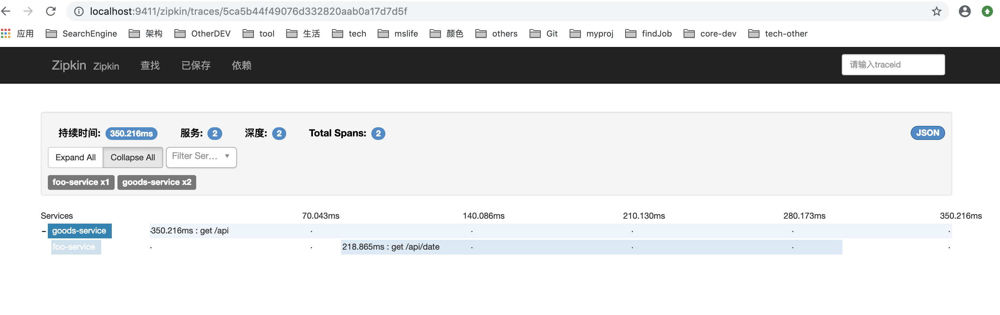

# svctracer

##quick start

* Step1

在自己的电脑上运行shell命令
```shell
curl -sSL https://zipkin.io/quickstart.sh | bash -s
```

这样会执行quickstart.sh，自动下载zipkin.jar到自己的机器上，并启动一个zipkin控制台的springboot进程

启动完毕后，访问[http://localhost:9411/zipkin/](http://localhost:9411/zipkin/)

<hr/>

注意：
如果网络不稳定，可能失败。
可以手动去下载zipkin.jar并自行执行程序, 下载页面[https://dl.bintray.com/openzipkin/maven/io/zipkin/java/zipkin-server/
](https://dl.bintray.com/openzipkin/maven/io/zipkin/java/zipkin-server/
)

运行方法:
```shell
##  Step1,这里可以先上网页上去看看最新版是多少。我给的这个版本足够新了。

wget https://dl.bintray.com/openzipkin/maven/io/zipkin/java/zipkin-server/2.9.4/zipkin-server-2.9.4-exec.jar

## Step2,运行jar
java -jar zipkin-server-2.9.4-exec.jar

```

可以进入zipkin的网页，如下：


点击"查找"按钮，可以查看所以被跟踪到的服务。

* Step2

启动goods-service和foo-service

* 在zipkin页面上查找运行的服务

在自己的浏览器上访问[http://localhost:28110/api](http://localhost:28110/api)

goods-service这里会调用foo-service

浏览器返回 [http://localhost:9411/zipkin/](http://localhost:9411/zipkin/)

点击"查看"按钮，可以看到goods-service和foo-service

效果如下:


<br/>




